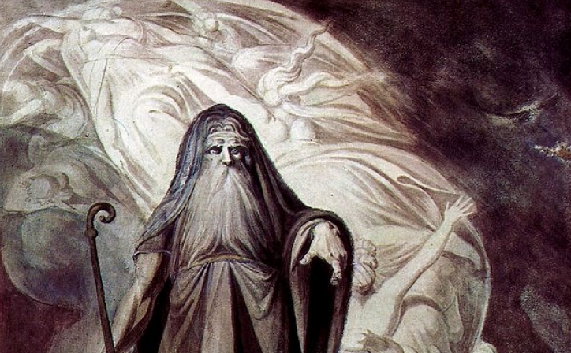
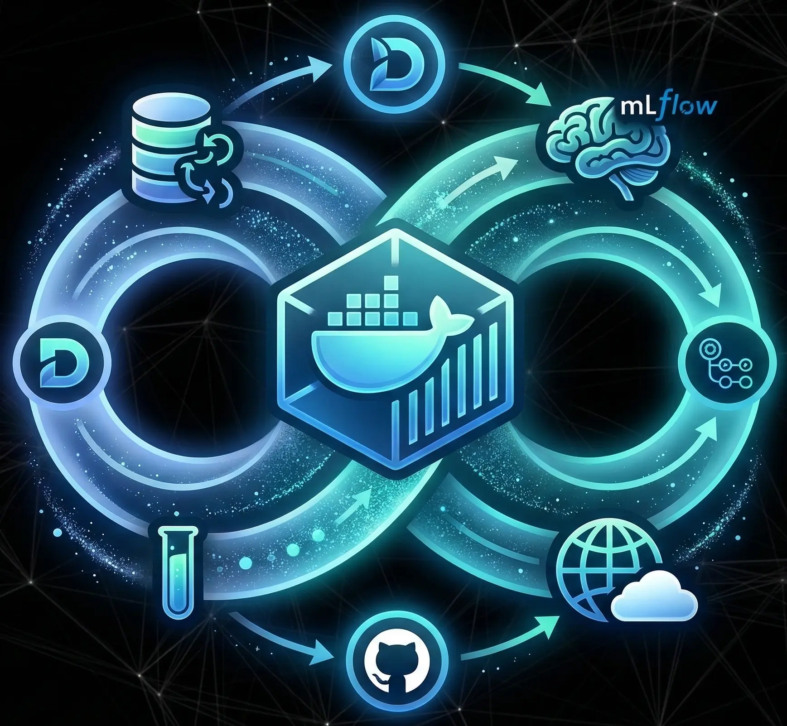
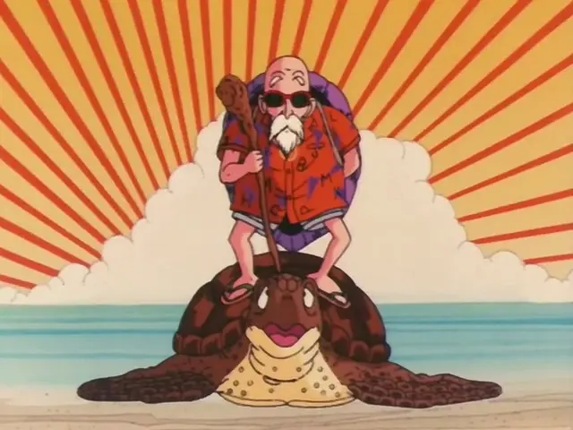
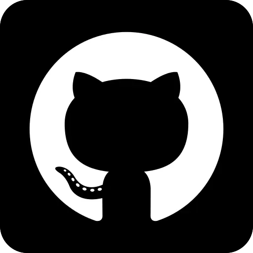
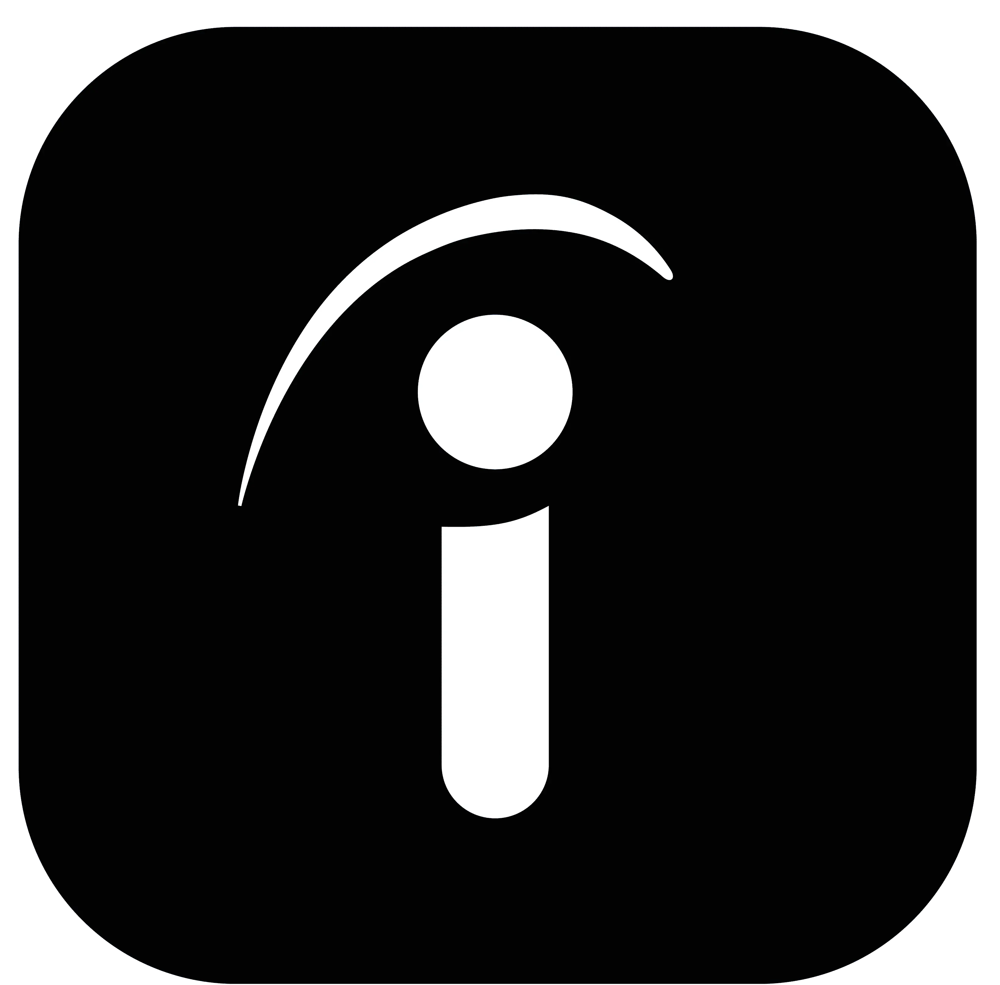

<!DOCTYPE html>
<html lang="it">
<head>
    <meta charset="UTF-8">
    <meta name="viewport" content="width=device-width, initial-scale=1.0">
    <title>Antonio | AI Engineer Portfolio</title>
    <link href="https://fonts.googleapis.com/css2?family=Inter:wght@300;400;700&display=swap" rel="stylesheet">
    
</head>
<body>

    

    <header>
        <a href="#">Home</a>
        <a href="#about">About</a>
        

            <a href="#projects">Projects</a>
            

                <a href="#tiresias">Tiresias Time Series</a>
                <a href="#mlops"> AI Component MLOps</a>
                <a href="#clustering">Muten Process Mining</a>
            

        

        <a href="#contacts">Profiles & Contacts</a>
    </header>

    

        <section class="hero">
            

                
Hello, Nice to meet you!

                <h1>I'm Antonio</h1>
                <h2>AI Engineer & Data Scientist</h2>
                
<a href="https://github.com/AntonioCampanozzi" class="view" target="_blank" rel="noopener noreferrer">Check out my resume! ↗</a>

            

            

                

            

        </section>

        

            MLOps
            Git
            Deep Learning
            Machine Learning
            Knowledge Graphs
            Computer Vision
            Process Mining
        

        <section id="about" class="about-section">
            

                <h3 class="interest-title">Main interests</h3>
                <ul class="custom-list">
                    <li>Knowledge Graph Embeddings</li>
                    <li>Time Series</li>
                    <li>Process Discovery</li>
                    <li>Agents</li>
                </ul>
            

            

                <h3 style="text-align: center; font-size: 2.5rem;">About me</h3>
                

                    My journey with computer science begins by chance... (incolla qui il tuo testo corretto).
                

            

        </section>

        <section id="projects" class="projects-section">  
            <h2 class="projects-title">Projects</h2>
            

                

                    <h3 id="tiresias">TIRESIAS</h3>
                    
Time Series

                    
Deep Learning

                    
CRISP-DM

                    
Deep Learning

                    
Data Analysis & Processing

                    
Developed a framework for the early prediction of mechanical resistance 
                        in additive manufacturing samples. By applying time-series clustering to experimental data, the system 
                        identifies representative medoids to establish critical failure thresholds for each stress test group.
                        TIRESIAS leverages these insights to forecast the specific stress levels a sample can withstand before 
                        reaching the "point of no return," enabling non-destructive evaluation and subsequent sample reuse. 
                        A comparative study between LSTM and XGBoost architectures proved XGBoost to be the superior approach, 
                        delivering prediction accuracy with significantly greater earliness.

                    <a href="https://github.com/AntonioCampanozzi/TIRESIAS" class="view" target="_blank" rel="noopener noreferrer">View project ↗</a>
                

                

                    
                

            

                

                    

                        <h3 id="mlops">Deployable AI Component</h3>
                        
DVC

                        
Docker

                        
FastAPI

                        
Github Actions

    
                        
Collaborated in a team to engineer a production-ready AI system focused on
                            the full MLOps lifecycle. While using diabetes diagnosis as a trivial example of prediction task, we built an integrated 
                            pipeline featuring DVC for data versioning and MLflow for experiments tracking. We automated the entire workflow
                            via GitHub Actions for CI/CD, deploying client and server containers to DockerHub and Hugging Face. The system is enriched 
                            by a Prometheus/Grafana monitoring stack and validated through Locust load testing to ensure stability 
                            under high traffic.

                        <a href="https://github.com/AntonioCampanozzi/MLOps_team_project" class="view" target="_blank" rel="noopener noreferrer">View project ↗</a>
                    

                    

                        
                    

                

                

                    

                        <h3 id="clustering">MUTEN: MUltiview Trace ENcodings</h3>
                        
Process Discovery

                        
Latent Space Encoding

                        
Signal Processing

                        
BERT

    
                        
MUTEN Is a multi-view extension of DOROTHY , a research framework designed to mitigate "spaghetti model"
                            complexity in non-Pareto event logs by applying clustering on encoded traces, extracting the process model only on the most 
                            representative instances. While the baseline uses Sentence-BERT to encode activity flow as semantic stories , I engineered an 
                            additional temporal view by applying Discrete Cosine Transform (DCT) to interpret time intervals as signals.  My research 
                            demonstrated that temporal dynamics alone are highly informative—achieving performance comparable to the original baseline —while
                            identifying critical challenges in multi-view feature fusion for imbalanced embedding dimensions.

                        <a href="https://github.com/AntonioCampanozzi/MUTEN" class="view" target="_blank" rel="noopener noreferrer">View project ↗</a>
                    

                    

                        
                    

                

        </section>

        <section id="contacts" class="contacts-section">
                <h2 class="contacts-title-h2">Do you wish to include me in your team?</h2>
                <h1 class="contacts-title-h1">Feel free to reach out!</h1>
                

                    
                    
                    
                    
                

        </section>

    
    
</body>
</html>
